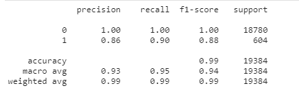
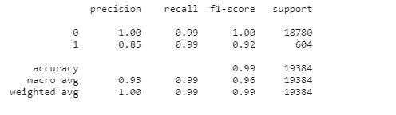

# Credit_risk_analysis
Credit risk poses a classification problem that’s inherently imbalanced. This is because healthy loans easily outnumber risky loans. Through this analysis, we used various techniques to train and evaluate models with imbalanced classes. We used dataset of historical lending activity from a peer-to-peer lending services company to build a model that can identify the creditworthiness of borrowers

## Technologies

This project leverages python 3.7 with the following packages:

* [Pandas](https://pandas.pydata.org/) - For data cleaning, preparation and manipulation

* [Jupyter Notebook](https://jupyter.org/) - An open-source web application that allows you to create and share documents that contain live code, equations, visualizations and narrative text.

* [Visual Studio Code](https://code.visualstudio.com/) - A code editor redefined and optimized for building and debugging modern web and cloud applications

## Installation Guide

Download Anaconda for your operating system and the latest Python version, run the installer, and follow the steps.

Before running the application first install the following dependencies.

```python

  pip install pandas
  pip install sklearn
  pip install imblearn
  pip install hvplot
```

To install PyViz and its dependencies in your Conda dev environment, complete the following steps:

1. From your terminal, log in to your Conda dev environment.
.
2. Install the PyViz packages by using the conda install command as follows:
    
	conda install -c plotly plotly=4.13.
    
    conda install -c pyviz hvplot
-----------------------------------------------------------------------------------------------------------------------------------------------------

## Usage


Classification matrix - this shows both 'healthy loan' and 'high risk loans' are good but stronger in prediciting 'healthy loans' and slightly weaker in predicting 'high risk loan'
1. What percent of your predictions were correct? - As seen from the 'precision score' of healthy loans '0', accuracy of positive predictions is 100%. For 'weak loans', it's 85%.
2. What percent of the positive cases did you catch? - As seen from the 'recall score' of health loans '0',fraction of positives 'good loans' that were correctly identified is 99%. For weak loans, it's 90%.
3. What percent of positive predictions were correct? - As seen from the F score of health loans '0', percent of positive predictions correct is 100%. For 'weak loans', it's 88%



----------------------------------------------------------------------------------------------------------------------------------------------------

Classification matrix after resampling  -  Strong in predciting healthy loans but 'high risk loan' got more weaker slightly changing from 0.86 to 0.85. However, after re-sampling we observed that recall value of 'high risk loan' increased from 0.90 to 0.99 and hence the model slightly got better to predict high risk loans. 

1. What percent of your predictions were correct? - As seen from the 'precision score' of healthy loans '0', accuracy of positive predictions is 100%. For 'weak loans', it's 84%.
2. What percent of the positive cases did you catch? - As seen from the 'recall score' of health loans '0',fraction of positives 'good loans' that were correctly identified is 99%. For weak loans, it's 99%.
3. What percent of positive predictions were correct? - As seen from the F score of health loans '0', percent of positive predictions correct is 100%. For 'weak loans', it's 91%



-----------------------------------------------------------------------------------------------------------------------------------------------------
Analysis - Both models before and after re-sampling, the values of 'precision' and 'recall' is high. Hence, both are good and both model predics all the classes properly. The F1 is good too. There is a slight overall increase in F1 'macro avg' score from 0.94 to 9.95 after re-sampling overall and also in increase in F1 score of 'weak loans'. 


----------------------------------------------------------------------------------------------------------------------------

.
## Contributors
Done by me Aruna.
