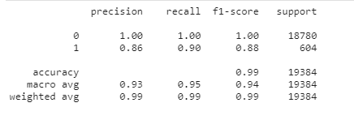

# Credit_risk_analysis
Credit risk poses a classification problem that’s inherently imbalanced. This is because healthy loans easily outnumber risky loans. Through this analysis, we used various techniques to train and evaluate models with imbalanced classes. We used dataset of historical lending activity from a peer-to-peer lending services company to build a model that can identify the creditworthiness of borrowers

## Technologies

This project leverages python 3.7 with the following packages:

* [Pandas](https://pandas.pydata.org/) - For data cleaning, preparation and manipulation

* [Jupyter Notebook](https://jupyter.org/) - An open-source web application that allows you to create and share documents that contain live code, equations, visualizations and narrative text.

* [Visual Studio Code](https://code.visualstudio.com/) - A code editor redefined and optimized for building and debugging modern web and cloud applications

## Installation Guide

Download Anaconda for your operating system and the latest Python version, run the installer, and follow the steps.

Before running the application first install the following dependencies.

```python

  pip install pandas
  pip install sklearn
  pip install imblearn
  pip install hvplot
```

To install PyViz and its dependencies in your Conda dev environment, complete the following steps:

1. From your terminal, log in to your Conda dev environment.

2. Install the PyViz packages by using the conda install command as follows:
    
	conda install -c plotly plotly=4.13.
    
    conda install -c pyviz hvplot
-----------------------------------------------------------------------------------------------------------------------------------------------------

## Usage



-----------------------------------------------------------------------------------------------------------------------------------------------------

.
## Contributors


